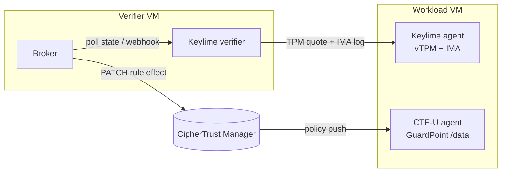

# keylime-cte-attestation-demo

A home-lab demo of **attestation-gated key release** for CipherTrust Transparent Encryption (CTE), without confidential-computing hardware or a cloud account.

CipherTrust's confidential-computing feature only releases encryption keys to a VM after Intel Tiber Trust Services has attested that it is a genuine, untampered Intel TDX guest. That needs TDX hardware on Azure or GCP. This repo recreates the same flow on an ordinary Proxmox host:

- **Keylime** attests a VM through its virtual TPM, using measured boot plus IMA runtime integrity.
- A small **broker** watches the Keylime verdict and flips a CTE security rule in CipherTrust Manager between `deny` and `permit,applykey`.

Run an unapproved binary on the VM and access to the encrypted data disappears within seconds.

## What this is, and isn't

- **It demonstrates the workflow, not the hardware guarantee.** The TPM is software (swtpm) with no manufacturer endorsement certificate, so EK checking is disabled. Nothing here proves the VM runs on trustworthy hardware.
- **The enforcement point differs from the real product.** In the real flow, CipherTrust Manager itself withholds keys until attestation passes. Here it releases them as normal, and the gate is a policy rule the broker toggles. [docs/attestation-flows.md](docs/attestation-flows.md) compares the two step by step.
- **It's a lab and demo tool, not a security control.** Don't use it to protect real data.
- **It isn't affiliated with or endorsed by Thales or Intel.** CipherTrust, CTE, TDX and Tiber are their respective owners' trademarks. You need your own CipherTrust Manager and CTE-U licences.

## Requirements

- A Proxmox VE host with snapshot-capable storage (LVM-thin or ZFS).
- Two Rocky Linux 9 VMs: a **verifier** and a **workload**. The workload uses OVMF with a v2.0 vTPM.
- CipherTrust Manager (tested on 2.24) reachable from both VMs, with a CTE-U licence.
- Keylime 7.12 or later, from Rocky's AppStream repo: `keylime` on the verifier, `keylime-agent-rust` on the workload.
- Local DNS for the lab hostnames. The docs use `ciphertrust.home.arpa`, `verifier.home.arpa` and `workload.home.arpa`.

## Repo layout

| Path | What it is |
|---|---|
| [`docs/RUNBOOK.md`](docs/RUNBOOK.md) | Full build guide, demo script and troubleshooting. Start here. |
| [`docs/attestation-flows.md`](docs/attestation-flows.md) | Sequence diagrams of the real TDX flow vs this lab, with a step mapping |
| [`broker/broker.py`](broker/broker.py) | The attestation broker (Python 3, `requests`) |
| [`broker/broker.env.example`](broker/broker.env.example) | Broker configuration template; copy to `/etc/attestation-broker.env` |
| [`broker/attestation-broker.service`](broker/attestation-broker.service) | systemd unit |
| [`config/verifier/`](config/verifier) | Keylime verifier, registrar and tenant config snippets |
| [`config/workload/`](config/workload) | Keylime agent config and the IMA policy |
| [`scripts/build-policies.sh`](scripts/build-policies.sh) | Builds Keylime measured-boot and runtime policies from the workload (run on the verifier) |
| [`scripts/reset-demo.sh`](scripts/reset-demo.sh) | Re-enrols the workload and waits for attestation (run on the verifier) |
| [`scripts/tamper.sh`](scripts/tamper.sh) | Runs an unapproved binary on the workload and times how long until access is denied (streamed from the verifier over SSH) |
| [`scripts/test-cm-api.sh`](scripts/test-cm-api.sh) | Exercises the CipherTrust Manager REST calls the broker makes |

## How the broker decides

Every 2 seconds the broker reads the agent's `operational_state` from the Keylime verifier:

| Verifier state | Broker action |
|---|---|
| `Get Quote` / `Get Quote (retry)` | Set the gated rule to `permit,audit,applykey` |
| `Failed`, `Invalid Quote`, `Tenant Failed` | Set it to `deny,audit` |
| Anything else, unreachable, or unknown | Set it to `deny,audit` |
| Revocation webhook received | Set it to `deny,audit` immediately |

It also forces `deny` on startup, so a broker restart never leaves data open by accident. It only calls CipherTrust Manager when the desired effect changes.

### Configuration

All settings come from environment variables, loaded by systemd from `/etc/attestation-broker.env`:

| Variable | Default | Purpose |
|---|---|---|
| `CM_URL` | `https://ciphertrust.home.arpa` | CipherTrust Manager base URL (the broker adds `/api/v1`) |
| `CM_USER` / `CM_PASS` | `broker-svc` / (none) | Service account; give it CTE policy edit rights only |
| `CM_VERIFY_TLS` | `false` | Set `true` once CipherTrust Manager's CA is trusted on the verifier |
| `CTE_POLICY_NAME` | `cc-demo-policy` | CTE policy containing the gated rule |
| `CTE_GATED_RULE_ORDER` | `1` | Which security rule (by order) to toggle |
| `EFFECT_ALLOW` / `EFFECT_DENY` | `permit,audit,applykey` / `deny,audit` | Rule effects for the two states |
| `KL_VERIFIER` | `https://127.0.0.1:8881` | Keylime verifier URL |
| `KL_API` | `v2.3` | Verifier API version; check with the `curl .../version` call in the runbook |
| `KL_TLS_NAME` | `server` | Name expected in the verifier's certificate (Keylime's auto-generated cert uses `server`) |
| `KL_AGENT_UUID` | (none) | Agent to watch |
| `KL_CA` / `KL_CERT` / `KL_KEY` | `/var/lib/keylime/cv_ca/...` | Keylime CA and tenant client certificate |
| `POLL_SECONDS` | `2` | Poll interval |
| `WEBHOOK_PORT` | `8080` | Port for Keylime revocation webhooks |

**Never commit `/etc/attestation-broker.env`.** It holds the CipherTrust Manager password. `.gitignore` excludes `*.env` apart from the example.

## Quick tour

1. Build the lab with [docs/RUNBOOK.md](docs/RUNBOOK.md), sections 0 to 4.
2. Snapshot the attested workload as `clean-attested`.
3. Demo: `cat /data/secret.txt` works. Then, from the verifier, run `ssh root@workload.home.arpa 'bash -s' < /root/kit/scripts/tamper.sh`, and access is denied within seconds.
4. Reset: roll back the snapshot, then run `scripts/reset-demo.sh` on the verifier.

## Licence

MIT. See [LICENSE](LICENSE).
