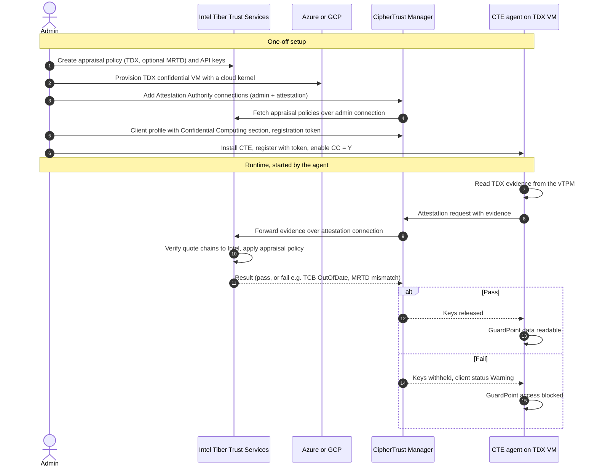
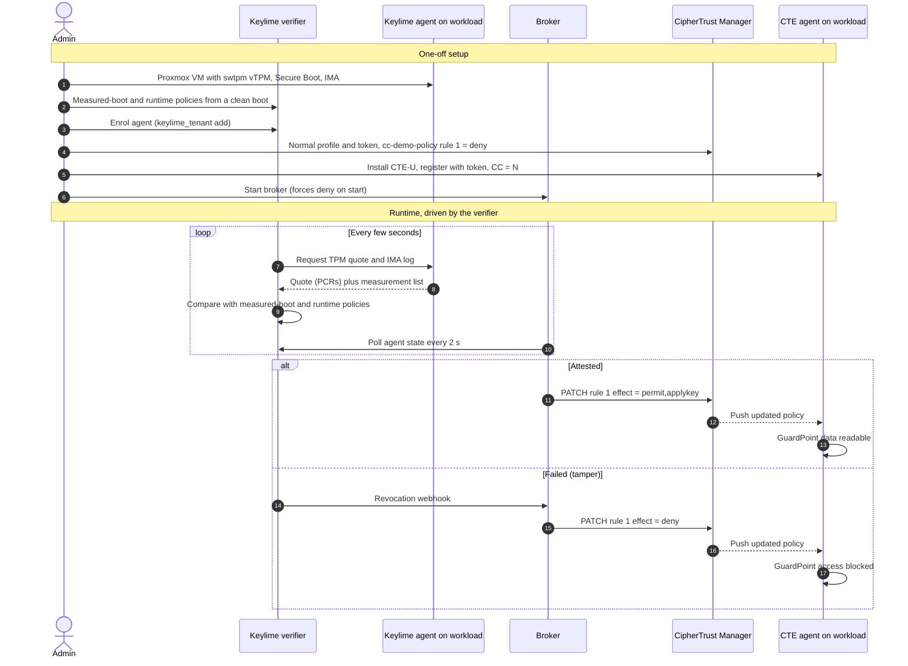

# Attestation flows: real hardware vs this lab

## Who triggers attestation

- **Real flow (Intel TDX on Azure or GCP):** the CTE agent starts it. Registering with Confidential Computing enabled and a client profile that names Intel Tiber Trust Services makes the agent send TDX evidence to CipherTrust Manager. CipherTrust Manager forwards it to Intel and releases or withholds keys based on the verdict.
- **This lab:** CipherTrust Manager and the CTE agent never know attestation exists. The Keylime verifier attests the VM every few seconds on its own. The broker turns that verdict into a CTE policy change, which CipherTrust Manager pushes to the agent as normal.

So the Intel portal, the Attestation Authority connections, the Confidential Computing section of the client profile, the CC prompt at install (answer N) and `cc_check` are all deliberately skipped.

## Real flow: Intel TDX and Intel Tiber Trust Services

Vendor documentation says CipherTrust Manager contacts Intel "when a request is received from the agent". It doesn't say how often the agent re-attests after registration.

## This lab: Keylime and the broker on Proxmox

The enforcement point moves. In the real flow, CipherTrust Manager gates key release itself. In the lab, it releases keys as normal and the gate is the policy rule the broker toggles. The audience sees the same outcome; say this once when presenting.

## Step-by-step mapping

| Real flow | This lab | Status |
|---|---|---|
| Intel portal: appraisal policy (TDX, MRTD), attestation and admin API keys | Keylime measured-boot and runtime policies | Replaced |
| TDX confidential VM on Azure or GCP, cloud kernel | Proxmox VM: q35, OVMF, Secure Boot, swtpm vTPM, Rocky 9 with pinned kernel | Replaced |
| CipherTrust Manager Attestation Authority connections | None; the broker uses a service account on the normal REST API | Skipped |
| Client profile Confidential Computing section | Normal client profile | Skipped |
| Registration token bound to the CC profile | Normal registration token | Same, minus CC |
| CTE install, answer Y to Confidential Computing | CTE-U install, answer N | Same, minus CC |
| `cc_check` and MRTD checks | `keylime_tenant -c cvstatus` shows `Get Quote` | Replaced |
| Agent sends TDX evidence; CipherTrust Manager forwards it | Keylime verifier pulls the TPM quote and IMA log | Replaced |
| Intel verifies and applies policy | Keylime checks PCRs and IMA hashes against policies | Replaced |
| CipherTrust Manager releases or withholds keys | Broker sets rule 1 to `permit,applykey` or `deny` | Replaced |
| Standard CTE policies and GuardPoints | `cc-demo-policy`, GuardPoint `/data` | Same |
